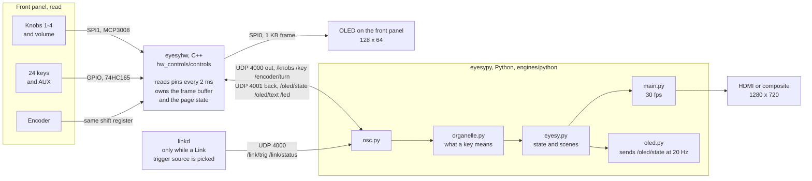
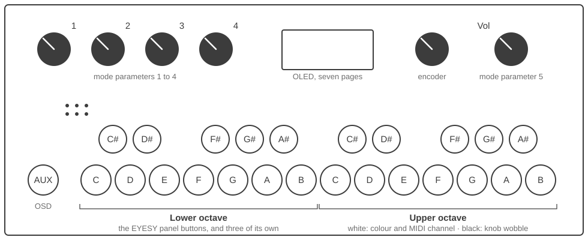

# EYESY on Organelle S

EYESY OS 3.1 adapted to the Organelle S front panel. The base system, audio
driver and boot configuration are the same as `platforms/eyesy_cm3` — the CM3
carrier boards are near identical — so only the control surface differs.

## What is different from eyesy_cm3

| | eyesy_cm3 | organelle_s |
|---|---|---|
| ADC order | `adcRead(4,2,0,1,3)` | `adcRead(0..5)` = knob 1-4, volume, expression |
| Keys sent | lowest 10, reordered by a lookup table | all 25 raw, `0` = AUX, `1-24` = keyboard from low C |
| Encoder | simplified edge detect | Organelle quadrature table, 2 detents per pulse |
| OLED | not driven | 7 pages, encoder switches them |
| Foot switch | polled, unused | sent as key `25`, saves a scene or fires the trigger |

The knob that plays the fifth mode parameter is the **volume knob**. The
Organelle applies volume in software, so on EYESY it is free to use as a
control.

## How it is put together

Two processes, both started by systemd, talking OSC over UDP loopback. The C++
side reads pins and sends numbers; it does not know what any of them mean.
Deciding that is the engine's job, which is why changing an assignment needs no
rebuild. It is also why the display keeps working while the engine is loading a
mode: the frame buffer and the page state live on the C++ side, and the engine
only sends it what to say.

A third joins them while an Ableton Link trigger source is selected: `linkd`,
started and stopped by the engine, reporting the beat on the same loopback.
It is separate because Link is GPL and this tree is BSD — see
[linkd/README.md](linkd/README.md).

Which half a change lands in decides what has to be run on the device:

| Changed | Needed |
|---|---|
| `engines/python/`, `web/` | `sudo systemctl restart eyesypy` |
| `platforms/organelle_s/hw_controls/` | `install.sh`, which rebuilds |
| `platforms/organelle_s/rootfs/` | `install.sh`, which deploys |

## Control map

Two octaves of twenty four keys, C to B twice, plus AUX. The lower octave is
the EYESY's own panel; the upper one is what an Organelle has spare.

Hold **C#** for the shifted layer.

| Key | Plain | With C# held |
|---|---|---|
| AUX | OSD on / off | System menu |
| C# | Shift | — |
| D# | Persist (auto clear off) | Knob sequencer: arm / record / play |
| C | Mode − | Foreground palette − |
| D | Mode + | Foreground palette + |
| E | Scene − | Background palette − |
| F | Scene + | Background palette + |
| G | Save scene (hold to delete) | Update current scene |
| A | Screen grab | Knob sequence play / stop |
| B | Trigger (hold for test tone) | Knob sequence record |
| F# | Audio input mute | Freeze the picture |
| G# | MIDI clock mute | MIDI note mute |
| A# | Auto random: off, then modes, then scenes, then off | — |
| Upper octave `C` / `D` | Foreground palette − / + | — |
| Upper octave `C`+`D` | Wobble the foreground palette, again to stop | — |
| Upper octave `E` / `F` | Background palette − / + | — |
| Upper octave `E`+`F` | Wobble the background palette, again to stop | — |
| Upper octave `G` | MIDI channel +1, wrapping at 16 | — |
| Upper octave `A` `B` | — | — |
| Upper octave black keys | Wobble knob 1 to 5, tap again to stop. Hold and turn that knob for its depth | — |
| Foot switch | Save scene, or the same as `B` — Settings > Controls picks which | Knob sequence arm / disarm, when set to Trigger |

Shift + knob 1 still sets the input gain, as on EYESY. Shift + knob 5 — the
one the panel prints **Volume** on — sets the audio thru level, see below.

**Foot Switch** on Settings > Controls says which of the two it does. It saves
by default, which is what it did before there was a choice.

Saving goes straight to `save_scene()` rather than through the save key, which
deletes the current scene when it is held for a second — which is what a foot
resting on a pedal looks like. Deleting stays on `G`.

Set to Trigger a plain press **is** the `B` key: it goes through that key's own
handler rather than a copy of part of it, so it fires the trigger, plays the
test tone while held, and repeats after about a third of a second, exactly as
the key does.

Shift and the pedal arm the knob sequencer, and disarm it next time. That one
does not go through `B`: holding key 10 down is what starts the test tone and
the repeat, and neither belongs on a pedal being used to arm a recorder.

Which of the two jobs the pedal has gets latched when it goes down, and the
**Foot Switch** row stops responding while the pedal or `B` is held, saying so
on screen. Letting the setting move under a press already in flight is how the
test tone ends up playing with no way back.

## The upper octave

**The lower octave acts when you press a key, the upper octave when you let
go.** That is not a quirk, it is what makes a pair of keys able to mean a third
thing: on the way down there is no telling a single key from the first half of
a chord. The black keys already worked this way — each doubles as its knob's
depth modifier, so it only acts when tapped rather than held — so the chord is
an instance of a rule that was already here.

A key that gets used as half of a chord is marked, and does nothing on its way
up. Pressing `C`, letting go, then pressing `D` is two separate steps; holding
`C` and then pressing `D` is the wobble.

`C` and `D` step the foreground palette down and up, `E` and `F` the
background. Held, a key keeps stepping — there are 43 palettes and tapping to
the far end of them is 42 presses. Stepping says nothing on the display: it is
visible in the picture, and 43 palettes gone past would be 43 messages over it.

The repeat starts after about **0.4 seconds**, and that same wait is the window
the chord has to arrive in. A key that has begun repeating is somebody
scrolling, so pressing its partner then steps back the other way rather than
switching the wobble — which means the two keys of a chord have to go down
together rather than one being held and the other added later.

Shift and the lower octave `C` `D` `E` `F` still move the palettes too. That
path is shared with EYESY hardware, which has no upper octave and would
otherwise have no way to change a palette at all.

## Palette wobble

Upper octave `C`+`D` together start the foreground palette picking a new one
every so often, `E`+`F` do the same for the background, and the same chord
again stops it. Each switches on
with a change rather than waiting out a cycle first, so the key has something
to show for itself, and neither ever picks the palette already showing.

**It runs on the Auto Random Cycle clock, not on the trigger.** This is the one
way it is unlike the knob wobble, and the difference is the point: a palette
that changed on every kick drum would be a strobe rather than a colour scheme.
It does not need the `A#` picker switched on — it borrows that setting's
interval, not the feature.

The two run on separate clocks. Started at different moments they change at
different moments, which is what you want; one clock would make the whole
picture blink at once.

Scenes carry it, the same way they carry the knob wobble. A scene also stores
the palette numbers that were showing, and recalling one with the wobble on
will move off them within a cycle — which is exactly what the knobs do too. A
scene saved before this existed loads with both off.

The `STATUS` page of the OLED has a lamp for each, and switching one says on
screen how often it will move. There is deliberately no letter for it in the
top bar; see [OLED](#oled).

## MIDI channel

Upper octave `G` steps the MIDI channel by one, wrapping from 16 back to 1, and
says the new number on screen. It is also on **Settings → Audio MIDI Settings**,
which is where it was before it had a key.

**It steps on the way up, not the way down, and holding it does nothing.** The
other repeating keys here fire every frame once they start, which would run 1
to 16 in about half a second and make landing on a channel a matter of luck. A
key leaned on cannot walk the channel away from you.

It works with a menu open too, since it is a setting rather than a performance
control, and the MIDI page is where you would be looking while you set it. Each
press is written to `config.json`.

## Settings > Controls

Three settings share a screen because they share a reason to exist: each
belongs to a key or the pedal jack rather than to a subsystem.

| | |
|---|---|
| **Foot Switch** | what the pedal does, save a scene or fire the trigger |
| **Knob Modulation** | what times the knob wobble: the trigger, or its own pace |
| **Auto Random Cycle** | what times the palette wobble and the `A#` picker |
| **Battery** | off for an Organelle S, on for an M |

The middle two are a pair — one times the knob wobble, the other the palette
wobble — and that was invisible while Knob Modulation sat under Audio MIDI
Settings, where it has nothing to do with MIDI, and the cycle sat under System
Stuff next to backing up an SD card. Which of them drove what got misremembered
more than once before they were put side by side.

The whole screen is organelle only, and so is its row in Settings: EYESY
hardware has no pedal, no upper octave and no key that switches the auto picker
on, so all three would be settings with nothing to set. System Stuff went back
to being the maintenance screen it was.

## Battery, on the Organelle M

The M is an S with a speaker and a battery, so one build covers both — which
means the battery cannot be a compile time choice the way it is in
`Organelle_OS`. **Settings > Controls > Battery** is that choice at run time,
and it is **off by default**.

Leaving it off matters on an S. The shutdown check reads GPIO 16 for "running
on cells", and that pin is set up with its pull up and pull down disabled — on
a machine with no battery circuit there is nothing driving it.

Switched on and looked at on one S, that pin reads **mains**: the `~` appears
beside the icon, and the halt cannot fire because it needs the pin to say
cells. So an S with this switched on by mistake is protected twice over. One
machine is not a guarantee, which is why the default stays off, but it does
mean the setting is not a trap.

Switched on, the SETTINGS page shows the charge out at the right of the `FPS`
row, with a `~` beside it while the mains are supplying it. The top bar has no
room, so a battery down to its last bar says so through a message instead.

At the shutdown threshold the display is given over to `Low Battery / Auto
Shutdown` and the machine halts. **There is no grace period**, which is what
`Organelle_OS` does with the same cells and the same thresholds: the margin is
already in the threshold, and waiting spends exactly the charge the shutdown is
there to save. Plugging in stops it — the check reads the power pin as well as
the latched flag, so a flag that never clears cannot halt a machine on mains.

It lives in the hardware process rather than the engine, so a card mid-write is
still protected when the engine is not running. **None of it is tested**: this
was built against `Organelle_OS` on an Organelle S, which has no battery to
read. The thresholds are theirs, unchanged.

The pedal row stops responding while the pedal or `B` is held and says why —
letting the setting move under a press already in flight is how the test tone
ends up playing with no way back.

## Auto random

`A#` steps a picker through off, picking modes at random, picking scenes at
random, and off again. It never picks what is already playing, which would
look the same as nothing happening.

**The state moves under the press, the picking waits until the key has been up
about half a second.** Getting from modes back to off means passing through
scenes, and picking on the press meant passing through recalled one — which
takes the mode, all five knobs, both palettes and the knob modulation with it,
a lot to lose on the way to switching something off. Two taps now land on off
having picked nothing. A single tap still reads as immediate: what the screen
says changes on the press, and only the picture waits.

How long it waits is set on **Settings → Controls** as **Auto Random Cycle**: 15,
30, 50 or 60 seconds, or `Random`, which draws a fresh interval between 15 and
60 seconds each time. The same setting times the palette wobble above, so it is
the one dial for how restless the instrument is. `M` or `S` in the top bar of
the OLED says the picker is running and which of the two it is picking.

It holds still while a menu is open, so it cannot change the mode out from
under someone reading a settings page. Picking scenes with none saved does
nothing and says so.

## Knob modulation

Each black key of the upper octave wobbles the knob above it — C# is knob 1
through to A# for knob 5. Tap it to start, tap again to stop.

**The movement is timed by whatever is driving the visuals.** Each trigger
picks somewhere new for the offset to head for and it glides there, and since
audio, MIDI notes, MIDI clock and Ableton Link all arrive as the same trigger,
the wobble follows whichever one is selected under Trigger Source. With
nothing triggering it settles on its last target and stays there, so muting
the audio with `F#` or the clock with `G#` stops it rather than leaving it
running on a clock of its own.

It rides on top of the position rather than sweeping the whole range. Scenes
store the set position, not wherever the wobble happened to be.

**While a knob is modulating it stops setting a value and shapes the wobble
instead**: turn it for the rate, or hold its own black key and turn it for the
depth. So the key that owns a knob's modulation is also what adjusts it — no
other modifier is involved, and shift on knob 1 is still the audio gain. The
OLED shows a bar for whichever one is moving, and each knob keeps its own pair.

Because the key doubles as a modifier it acts on release, and only when it was
tapped: holding it while turning its knob adjusts the depth and leaves the
modulation running.

The knob sequencer and the wobble both write the same five knobs, so they do
not run together. Starting a wobble while the sequence is playing — `Q` in the
top bar — is refused, and the key says why. Starting the sequence drops any
wobble that was running, which is also what happens when a scene carrying both
is recalled. Switching a running wobble off is always allowed.

Rate is how quickly the offset reaches each new target, on an exponential
curve so the slow end is not all crammed into the first millimetre of travel.
Turned up, the wobble lands on the beat and waits there; turned down it is
still travelling when the next one arrives. To move the centre position,
switch modulation off, set it, and switch back on.

**Both are picked up rather than grabbed.** The knob is one physical thing and
several settings share it — the mode parameter, the rate, the depth, and with
shift the input gain on knob 1 and the audio thru level on knob 5 — so whichever
one it is aimed at finds the knob wherever the last one left it. Nothing moves
until the knob is brought to where that value already is; from there it follows.

Which is what makes them independent. Set a rate at the far right, hold the key
for the depth, and the depth stays where it was until the knob is turned back
down to it: a fast wobble that only moves a little is reachable. Without this
the depth was dragged to the far right the moment the knob twitched, and
neither could be nudged once set.

The OLED shows the value being hunted for while it is being hunted for, so
there is something to aim at, and starts following the knob once it has been
picked up. Switching modulation off leaves the value where it was rather than
snapping it to wherever the knob ended up.

Scenes carry all of it: which knobs were wobbling and the rate and depth each
one had. A scene saved before this existed simply has nothing wobbling.

`config.json` holds the starting point for all five:

| | default | |
|---|---|---|
| `knob_mod_depth` | 0.25 | how far either side of the knob it can swing |
| `knob_mod_rate` | 0.15 | how quickly it reaches each target |
| `knob_mod_sync` | true | step on the trigger; false brings back a wobble that keeps its own time. Also on **Settings → Audio MIDI Settings** |

## Audio thru

The Organelle has an audio output and EYESY has nothing to play through it, so
**Audio In goes straight to Audio Out**. Hold shift and turn knob 5 to set how
loud, from silent to a little above unity. The OLED shows a bar while it moves,
the same one the modulation controls use, and the level is saved when shift
comes up.

It starts at silent, so this does nothing at all until the knob is turned.

**It costs no CPU.** The signal never reaches the CPU: the WM8731 has an
analogue path from its line input to its output mixer, inside the chip, and
all the engine does is close that switch once at startup. No samples are
copied, no thread runs, and the frame rate never sees it. There is no
conversion either, so the passthrough is not resampled to the 32kHz the
analysis runs at and adds no latency.

Reading the capture stream back out through a playback stream would have put
the audio in the same place as the drawing, where one late frame is a click.
That is the version this replaces, and why the answer to "how much does it
cost" is nothing rather than a number.

There is no on/off switch because zero on the knob is the codec's own mute.
The knob has to be moved a little before it takes hold, so pressing shift
never jumps the level to wherever knob 5 was left sitting.

**Knob 5 hands itself back to the mode where you leave it.** It is a mode
parameter the rest of the time, and letting go of shift gives it to the mode at
its new position rather than the one it had. Shift on knob 1 has always done
this with the gain; setting the level here is the same thing on knob 5. Put the
knob back before letting go if that parameter was somewhere you wanted it.

**The headphone jack follows the knob, the 1/4in outputs do not.** They are
different pins on the codec. The level control lives inside the headphone
amplifier, and the 1/4in outputs are taken from the output mixer ahead of it,
so they carry the passthrough at a fixed line level however the knob is set —
and they do not get the +6dB at the top of it either. Whatever is downstream is
expected to have its own level, which is what makes knob 5 a monitoring
control.

The stock Organelle is not like this because Pd scales the samples before they
reach the DAC, which is ahead of both jacks. Nothing here goes near the DAC,
which is the whole reason it is free.

There is one other gain stage in the path, the input PGA — `Capture Volume` in
ALSA — and it was measured to reach both jacks, so it would have made the 1/4in
outputs adjustable. It is deliberately left alone. It also feeds the ADC, so
turning the monitor down would take the visuals with it, and not gently: at the
bottom of its range the signal drops by a factor of 53, which even the largest
software gain the engine offers cannot lift back over the audio trigger
threshold. Turning down the monitor would stop the picture moving.

The output amp is the level control, which nothing else uses. The input gain
(shift + knob 1) is a software multiplier applied to the analysis only, so the
two do not interact: turning the visuals up does not turn the monitor up.

| | default | |
|---|---|---|
| `audio_thru_volume` | 0.0 | 0 is muted, 1 is +6dB. The knob spans -60dB to +6dB above zero |

## Ableton Link

Pick one of the **Link** entries under **Settings → Audio MIDI Settings →
Trigger Source** and the visuals follow the beat of anything else on the
network — Live, an iPad, another Organelle. There is no separate on switch:
Link runs exactly while a Link trigger source is selected. `G#` mutes it, the
same key that mutes the MIDI clock, and the MIDI page says which clock is
driving and how many peers it can see.

Link is a separate program here, because it is GPL and this tree is BSD, so
its source is not in this repository and has to be cloned to `~/link` before
`install.sh` will build it — see [Build and install](#build-and-install) and
[linkd/README.md](linkd/README.md). Until that is done the Link trigger
sources are selectable but nothing answers, and the MIDI page says `Link off`.

A trigger lands on the next frame, so it can be up to 33 ms late. That is true
of the MIDI clock sources too. It is enough to lock visuals to a beat and not
enough to call it sample accurate.

## OLED

The hardware process owns the frame buffer and the page state so the display
keeps working while the video engine is loading modes or restarting. The engine
pushes it state over OSC; see `engines/python/oled.py` and `OledPages.cpp`.

Turn the encoder to page. Pressing it switches whatever on/off setting the
page in front of you owns, and does nothing on the pages that have none — a
dot next to the page number marks the ones the encoder does anything on.

**Hold the encoder for three seconds on `SETTINGS` to restart the video
engine.** There is a Restart Video in the settings menu already, but that menu
is drawn by the engine, on the video output — which makes it no use for the two
occasions you want it: when nothing is plugged into the video output to read it
on, and when the engine itself is what has stopped. The encoder and this
display are the only controls that outlive the engine, so the restart is one of
them, and it runs `systemctl restart eyesypy` from the hardware process rather
than asking the engine to exit. Asking only works while it is well enough to be
asked.

A bar fills while it is held and letting go abandons it. Three seconds and a
bar because a restart cannot be taken back, unlike the stream switch that the
same button toggles one page along.

| | Page | Press |
|---|---|---|
| 1 | **PERFORM** — mode, scene, five knob positions, stereo VU, input gain | — |
| 2 | **STATUS** — knob and palette wobble lamps, both palette names, the auto random cycle, trigger source | — |
| 3 | **SETTINGS** — wifi network, IP address, resolution, frame rate, version | Restart Video, held |
| 4 | **MIDI** — channel, the nine mapped CCs over two lines, whether notes pick the mode, input device | — |
| 5 | **LIVE** — video stream state and the address to watch it at | Stream on / off, if there is a network |
| 6 | **CTRL 1/2** — the lower octave, in short form | — |
| 7 | **CTRL 2/2** — the upper octave | — |

**The knob will not start the stream when the page says `no network`.** It says
so and leaves it stopped, rather than reporting `ON STREAMING` with nowhere to
watch it — which is what it used to do. Stopping is always allowed: a stream
begun while there was a network still has an encoder running after it goes.

The page and the press read the same address, deliberately. If they could
disagree, a refusal would look like a fault.

Pages declare their setting by name in `OledPages::toggleAction()`, and
`osc.py` maps the name to the action, so wiring a switch to another page is
two lines.

`SETTINGS` and `STATUS` swapped names when the second one grew: the wifi and
resolution page says how the instrument is set up, and the page that gained
palettes, channel and trigger source says what it is doing. `STATUS` sits
second because it is the one to glance at mid set; the other two are pages you
go and look at.

`CTRL 1/2` is not spelled `CONTROLS 1/2` because twelve characters run to x 74
and straight through the status letters, which start at x 52.

**The rule under the title is drawn after the page, not with the title.**
`setLine()` clears the row above whatever line it writes, and that row is this
one, so the three pages that use it — PERFORM, SETTINGS, MIDI — used to rub the
rule out again and only the pages avoiding `setLine` had one.

The MIDI page lost its clock row, which was the only place the Link tempo and
peer count appeared. A Link session is still visible as the selected trigger
source on `STATUS`, and `K` in the top bar still says the clock is muted, but
the tempo is no longer displayed anywhere. `link.py` still tracks it.

Palette names run to twenty nine characters, so on `STATUS` they slide the way
the mode name does on `PERFORM`, on their own clocks. With the two letter tag,
27 of the 43 names fit and sit still; only the other 16 move.

`STATUS` shows the **Auto Random Cycle** rather than the MIDI channel, which is
one turn away on `MIDI`. The cycle times the two palette lamps above it as well
as the `A#` picker, and its only other home is Settings > Controls. It is
labelled `Auto Cycle`: the full name is seventeen characters before the value.

On `CTRL 2/2` the knob range is written `C# - A# Knob Mod` across a whole row.
Butted up the way the pairs are, `C#A#` reads as one key with a stray sharp.

**A mode or scene name too long for its line slides through it** rather than
being cut off at the right hand edge. It holds at the start for a second and a
half, steps left two characters a second, holds again with the last character
on screen, and goes back to the beginning. `12/57 ` and `S 2/8 ` stay put — the
numbers are read at a glance and the names are what run off the end. Changing
mode or scene, or leaving the page and coming back, starts from the left again.

The two lines keep their own clocks. They are usually different lengths, so a
shared one would reach the end of the short name first and they would come
apart at the holds regardless; a name short enough to fit simply sits still.

Wrapping was the alternative, and neither line has anywhere to move down to.
Nothing else on the page can shift either, so the names move instead.

It costs nothing to run. The engine pushes `/oled/state` every 50ms and that
marks the page dirty, so the display is already being redrawn and shipped over
SPI twenty times a second whatever the names are doing; each line adds a
counter and an offset into a string.

Letters in the top bar: `X` audio muted, `K` clock muted, `N` notes muted,
`F` frozen, `P` persist, `M` auto random picking modes, `S` auto random
picking scenes, `r` sequencer armed, `R` recording, `Q` sequence playing,
`^` shift held.

Eight fit before the wifi icon and eight is as many as can be set at once,
since `M` and `S` are the two things the picker can be doing and only one of
them is ever true. They are still written in the order they would be given up,
`^` first, being the only one you are holding down while you read it. The
eighth slot came from retiring `MODE KEYS`: at nine characters it was the
longest page name and it cost a letter.

**The palette wobble has no letter here on purpose.** It follows the knob
wobble instead — a lamp on the `STATUS` page and a message when it is switched —
which is what keeps this row from growing every time something new can be
switched on.

Audio mute is `X` and shift is `^` because the auto picker wanted `M` and `S`
to say which of the two things it is picking, and one letter meaning two
things is worse than a letter that has to be learned.

On PERFORM the five bars are the knobs in panel order, knob 1 to 4 then
volume, and `L` `R` `G` are the input meters and the gain. A dot over a bar
means that knob is being wobbled — the same filled circle the STATUS page uses, and
drawn only for the knobs it applies to, so the usual case stays quiet.

The thin bar blinking under the meters is the trigger, the same thing the
yellow square shows in the video OSD — what makes it fire is the `Trig`
setting on the MIDI page.
A trigger only lasts one frame, so it is latched between display refreshes
rather than being missed.

The LIVE page is the quickest way to get the video onto a laptop mid set:
page to it, press the encoder, and the address shown is what to open in a
browser. See `web/STREAMING.md`.

### Messages

Pressing a key that changes something puts a message over the current page for
a second. Both lines are the small font: the second one carries the mode name,
the scene name, the reason — the half you are actually reading for — so making
the first one big only made the important half the harder one to read.

A reversed marker at the start says which kind it is, the same reversed block
the key names wear:

| Mark | Means | Example |
|---|---|---|
| `i` | it happened | `i Scene saved` / `scene-0004` |
| `!` | it did not | `! Modulation` / `knob seq is playing` |

Warnings stay up about twice as long, since a refusal has to be read to be any
use and a confirmation does not. Send them with `oled.warn()` instead of
`oled.notify()` — that is the whole difference at the call site.

The message is drawn over the page rather than instead of it, so a second of
message does not cost you your place. Line one fits 18 characters next to the
marker, line two fits 20 across the full width.

### Working on the layout without the device

`tools/oled_preview.cpp` renders every page to a raw frame buffer dump and
`tools/oled_view.py` turns those into a PNG, so layout changes can be checked
on a laptop:

    make -f tools/Makefile
    ./oled_preview /tmp/oled
    python3 tools/oled_view.py /tmp/oled*.raw -o /tmp/oled.png

A contact sheet says whether a layout is right and nothing about whether a
speed is. `tools/oled_anim.cpp` covers the other half: it ticks the same
`OledPages` on the same 50ms clock `main.cpp` uses and dumps a frame per
refresh, and `--html` plays them back at that interval in a self-contained page
with no dependencies. So the scroll can be watched at its real speed, and any
constant that governs it argued about, before anything is flashed.

    make -f tools/Makefile oled_anim
    ./oled_anim /tmp/anim
    python3 tools/oled_view.py --html /tmp/anim.html /tmp/anim*.raw

`oled_anim` takes the mode name as a second argument and the scene name as a
third, so the awkward lengths — one character over the line, twice the line,
one of each — can be tried directly.

    ./oled_anim /tmp/anim "a very long mode name" "a very long scene name"

The Makefile points clang at the SDK when `uname` says Darwin, so a bare `make`
works on a Mac as well as on the device. Without it MacPorts' `g++` is found
first and the build dies on `<string>`.

## Build and install

Unlike `eyesy_cm3`, the built `controls` binary is **not** committed here — it
is gitignored and has to be built on the device. A prebuilt one would be an
EYESY binary sitting where the Organelle binary belongs, and a stale one runs
with the wrong ADC order and key map without complaining. If `eyesyhw.service`
fails with "no such file", the build step below has not been run.

**The root filesystem is normally read only**, so nothing can be pulled or
built until it is remounted. `Tools/remount-rw.sh` does that, and
`Tools/remount-ro.sh` puts it back:

    sudo ~/EYESY_OS/Tools/remount-rw.sh

`sudo` because the scripts call `mount` directly rather than reaching for it
themselves, unlike `install.sh`. They remount `/boot/firmware` as well as `/`,
which `install.sh` does not — it only needs `/`.

Run it **before `git pull`**, not just before `install.sh`. `install.sh`
remounts `/` on its own, but by then the pull has already had to write.

**For Ableton Link, clone it first.** `install.sh` builds `linkd` only if the
headers are already there, so doing this afterwards means running `install.sh`
again. Skip it and everything else still works, Link included in the trigger
source list but reporting nothing.

    git clone --recurse-submodules https://github.com/Ableton/link ~/link

`--recurse-submodules` is not optional: the asio it needs to build is a
submodule, and without it the compile fails on a missing header.

Then, as the `music` user — not with sudo, or the build output ends up owned by
root and the next `git pull` trips over it:

    ~/EYESY_OS/platforms/organelle_s/install.sh

That remounts `/` writable, builds `controls`, builds `linkd` if `~/link` is
there and says it is skipping it if not, runs `deploy.sh` and restarts the
services. `/` is left writable, so reboot before pulling the plug.

`deploy.sh` installs the systemd units from `rootfs/`, which point at this
platform directory and set `EYESY_PLATFORM=organelle_s` for the video engine.
That environment variable is what selects the Organelle key mapping — without
it the engine behaves exactly like stock EYESY.

### Getting the code onto the device

The changes are not confined to this directory: `engines/python` and `web`
change too, and the C++ here sends raw key indices that only the new engine
understands. Copying just `platforms/organelle_s` across leaves the keyboard
worse than stock, so move the whole tree.

The device's `origin` is the upstream repo, which does not have this branch.
Add your own fork as a second remote once:

    sudo ~/EYESY_OS/Tools/remount-rw.sh
    cd ~/EYESY_OS
    git remote add s <your fork url>
    git fetch s
    git checkout -b organelle-s s/organelle-s

After that each round trip is three lines:

    sudo ~/EYESY_OS/Tools/remount-rw.sh
    cd ~/EYESY_OS && git pull s organelle-s
    platforms/organelle_s/install.sh

`install.sh` leaves `/` writable. Either reboot before pulling the plug, or put
it back by hand:

    sudo ~/EYESY_OS/Tools/remount-ro.sh

## Checking the mapping

The front panel mapping and the stream settings have unit tests that need no
hardware:

    cd ~/EYESY_OS/engines/python
    python3 -m unittest discover -s tests -v
