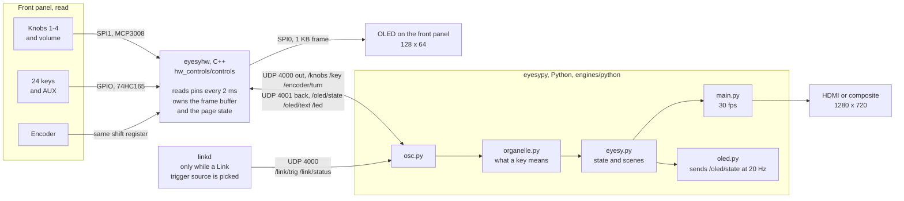

# EYESY on Organelle M and S

EYESY OS 3.1 adapted to the Organelle front panel. The base system, audio
driver and boot configuration are the same as `platforms/eyesy_cm3` — the CM3
carrier boards are near identical — so only the control surface differs.

The M is an S with a speaker and a battery behind the same panel, so one build
covers both. The directory and `EYESY_PLATFORM=organelle_s` keep the `_s` name
because that is the machine it was written on; nothing in the code branches on
which of the two it is running on, apart from the battery setting.

For what the keys, knobs and OLED pages do, see [MANUAL.md](MANUAL.md).

## What is different from eyesy_cm3

| | eyesy_cm3 | organelle_s |
|---|---|---|
| ADC order | `adcRead(4,2,0,1,3)` | `adcRead(0..5)` = knob 1-4, volume, expression |
| Keys sent | lowest 10, reordered by a lookup table | all 25 raw, `0` = AUX, `1-24` = keyboard from low C |
| Encoder | simplified edge detect | Organelle quadrature table, 2 detents per pulse |
| OLED | not driven | 7 pages, encoder switches them |
| Foot switch | polled, unused | sent as key `25`, saves a scene or fires the trigger |

The knob that plays the fifth mode parameter is the **volume knob**. The
Organelle applies volume in software, so on EYESY it is free to use as a
control.

## How it is put together

Two processes, both started by systemd, talking OSC over UDP loopback. The C++
side reads pins and sends numbers; it does not know what any of them mean.
Deciding that is the engine's job, which is why changing an assignment needs no
rebuild. It is also why the display keeps working while the engine is loading a
mode: the frame buffer and the page state live on the C++ side, and the engine
only sends it what to say.

A third joins them while an Ableton Link trigger source is selected: `linkd`,
started and stopped by the engine, reporting the beat on the same loopback.
It is separate because Link is GPL and this tree is BSD — see
[linkd/README.md](linkd/README.md).

Which half a change lands in decides what has to be run on the device:

| Changed | Needed |
|---|---|
| `engines/python/`, `web/` | `sudo systemctl restart eyesypy` |
| `platforms/organelle_s/hw_controls/` | `install.sh`, which rebuilds |
| `platforms/organelle_s/rootfs/` | `install.sh`, which deploys |

## Working on the OLED layout without the device

`tools/oled_preview.cpp` renders every page to a raw frame buffer dump and
`tools/oled_view.py` turns those into a PNG, so layout changes can be checked
on a laptop:

    make -f tools/Makefile
    ./oled_preview /tmp/oled
    python3 tools/oled_view.py /tmp/oled*.raw -o /tmp/oled.png

A contact sheet says whether a layout is right and nothing about whether a
speed is. `tools/oled_anim.cpp` covers the other half: it ticks the same
`OledPages` on the same 50 ms clock `main.cpp` uses and dumps a frame per
refresh, and `--html` plays them back at that interval in a self-contained page
with no dependencies. So the scroll can be watched at its real speed, and any
constant that governs it argued about, before anything is flashed.

    make -f tools/Makefile oled_anim
    ./oled_anim /tmp/anim
    python3 tools/oled_view.py --html /tmp/anim.html /tmp/anim*.raw

`oled_anim` takes the mode name as a second argument and the scene name as a
third, so the awkward lengths — one character over the line, twice the line,
one of each — can be tried directly.

    ./oled_anim /tmp/anim "a very long mode name" "a very long scene name"

The Makefile points clang at the SDK when `uname` says Darwin, so a bare `make`
works on a Mac as well as on the device. Without it MacPorts' `g++` is found
first and the build dies on `<string>`.

## Build and install

Unlike `eyesy_cm3`, the built `controls` binary is **not** committed here — it
is gitignored and has to be built on the device. A prebuilt one would be an
EYESY binary sitting where the Organelle binary belongs, and a stale one runs
with the wrong ADC order and key map without complaining. If `eyesyhw.service`
fails with "no such file", the build step below has not been run.

**The root filesystem is normally read only**, so nothing can be pulled or
built until it is remounted. `Tools/remount-rw.sh` does that, and
`Tools/remount-ro.sh` puts it back:

    sudo ~/EYESY_OS/Tools/remount-rw.sh

`sudo` because the scripts call `mount` directly rather than reaching for it
themselves, unlike `install.sh`. They remount `/boot/firmware` as well as `/`,
which `install.sh` does not — it only needs `/`.

Run it **before `git pull`**, not just before `install.sh`. `install.sh`
remounts `/` on its own, but by then the pull has already had to write.

**For Ableton Link, clone it first.** `install.sh` builds `linkd` only if the
headers are already there, so doing this afterwards means running `install.sh`
again. Skip it and everything else still works, Link included in the trigger
source list but reporting nothing.

    git clone --recurse-submodules https://github.com/Ableton/link ~/link

`--recurse-submodules` is not optional: the asio it needs to build is a
submodule, and without it the compile fails on a missing header.

Then, as the `music` user — not with sudo, or the build output ends up owned by
root and the next `git pull` trips over it:

    ~/EYESY_OS/platforms/organelle_s/install.sh

That remounts `/` writable, builds `controls`, builds `linkd` if `~/link` is
there and says it is skipping it if not, runs `deploy.sh` and restarts the
services. `/` is left writable, so reboot before pulling the plug.

`deploy.sh` installs the systemd units from `rootfs/`, which point at this
platform directory and set `EYESY_PLATFORM=organelle_s` for the video engine.
That environment variable is what selects the Organelle key mapping — without
it the engine behaves exactly like stock EYESY.

### Getting the code onto the device

The changes are not confined to this directory: `engines/python` and `web`
change too, and the C++ here sends raw key indices that only the new engine
understands. Copying just `platforms/organelle_s` across leaves the keyboard
worse than stock, so move the whole tree.

The device's `origin` is the upstream repo, which does not have this branch.
Add your own fork as a second remote once:

    sudo ~/EYESY_OS/Tools/remount-rw.sh
    cd ~/EYESY_OS
    git remote add s <your fork url>
    git fetch s
    git checkout -b organelle-s s/organelle-s

After that each round trip is three lines:

    sudo ~/EYESY_OS/Tools/remount-rw.sh
    cd ~/EYESY_OS && git pull s organelle-s
    platforms/organelle_s/install.sh

`install.sh` leaves `/` writable. Either reboot before pulling the plug, or put
it back by hand:

    sudo ~/EYESY_OS/Tools/remount-ro.sh

## Checking the mapping

The front panel mapping and the stream settings have unit tests that need no
hardware:

    cd ~/EYESY_OS/engines/python
    python3 -m unittest discover -s tests -v
